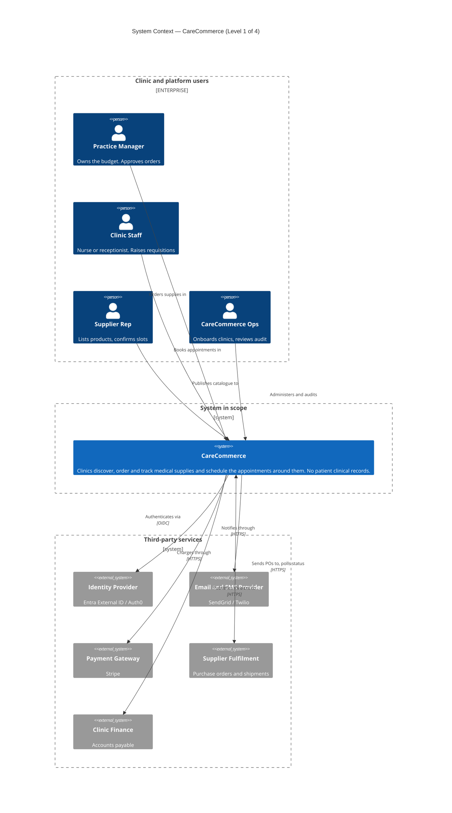
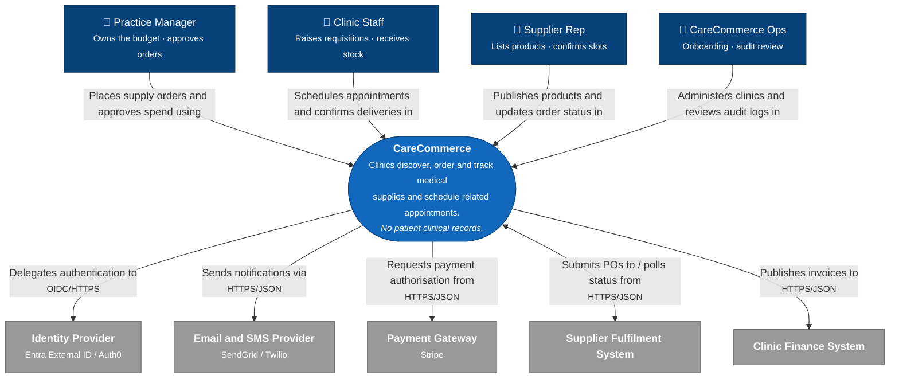

# C4 — System Context (Level 1 of 4)

**System:** CareCommerce
**Owner:** Apurba
**Date:** 2026-09-10 · Week 1 — Quest "Hello, CareCommerce"
**Status:** Accepted · reviewed each quarter

---

## Scope

> **CareCommerce lets clinics discover, order and track medical supplies, and schedule the appointments around them.**

**Explicitly out of scope:** patients — entirely. An *Appointment* here is a supply-side visit
(a delivery slot, an equipment service call, a rep consultation), never a patient booking. No
patient identity, record or clinical data exists anywhere in this system. **No PHI crosses this
boundary** — that is the constraint the audit middleware (Week 3) exists to enforce, and the
reason it can log freely.

Also out of scope: controlled/scheduled drugs, prescription dispensing, implantable devices.
See **Ubiquitous language** below for what each term means and why these lines were drawn there.

**Why this diagram is stable:** Level 1 shows only *who uses the system* and *what it depends on*.
The modular-monolith-vs-services decision (ADR-001) is invisible here by design. If this diagram
has to change when Notifications is extracted in Week 10, or when Q2 splits it into three
services, then it was drawn at the wrong level.

---

## The diagram

**Why it looks like this.** Mermaid's C4 renderer draws every relationship label at the arrow's
midpoint with no collision avoidance, so nine arrows converging on one central box pile their text
on top of each other. Three changes fix it, and they are worth knowing for every C4 diagram you
draw this year:

1. **Three stacked boundaries** — users on top, CareCommerce in the middle, third parties below.
   A bare `System(...)` sitting between two boundaries drifts out of the centre, so the middle one
   is wrapped in `Boundary(scope, "System in scope")` purely to pin the row. With
   `$c4BoundaryInRow="1"` each boundary claims a full row, which is what produces the stack.
2. **Short arrow labels** — 2–4 words. The full sentences live in the Cast tables below, which is
   where a reader can actually take them in.
3. **`UpdateRelStyle` offsets** nudge each label off the midpoint by hand, staggered left-to-right
   so the four inbound and five outbound labels never share a spot. This is the only real layout
   control the C4 renderer gives you; if you add or remove a relationship, re-tune the
   `$offsetX` / `$offsetY` values or the pile-up comes back.

### Fallback rendering

Mermaid's `C4Context` is still experimental, and its only layout control is the hand-tuned offsets
above. This flowchart carries the identical model and lays itself out — use it if the block above
still renders badly in your viewer, or if you would rather not re-tune offsets on every change.

---

## Cast

### People

| Person | What they do | Why they earn a box |
| --- | --- | --- |
| **Practice Manager** | Owns the clinic account and its budget. Approves requisitions into orders, sets spend limits, manages users and delivery addresses | Holds spend authority — the only role that can commit money |
| **Clinic Staff** | Nurses, receptionists, assistants. Notice stock is low, raise requisitions, book delivery and service slots, receive stock against an order | Day-to-day operational user; highest session volume, no spend authority |
| **Supplier Rep** | Publishes and prices products, updates fulfilment status | Supply side of the marketplace; writes data we don't own |
| **CareCommerce Ops** | Onboards clinics, resolves disputes, reviews the audit trail | The audit middleware needs a human reader |

### External systems

| System | Relationship | Enters the build at |
| --- | --- | --- |
| **Identity Provider** — Entra External ID / Auth0 | CareCommerce delegates authentication; receives JWTs | Week 7 — Quest "Auth Shield" |
| **Email and SMS Provider** — SendGrid / Twilio | CareCommerce pushes order and appointment notifications | Week 10 — Notifications extraction |
| **Payment Gateway** — Stripe | CareCommerce requests authorisation and capture | Q2 — checkout flow |
| **Supplier Fulfilment System** | CareCommerce submits POs; polls shipment status back | Q2 — orders leave the building |
| **Clinic Finance System** | CareCommerce publishes invoices for accounts payable | Q2+ |

All five are drawn now although none is built yet. Level 1 shows the *intended* boundary — that is
correct, not premature. It is the contract the next 65 weeks are measured against.

---

## Ubiquitous language

Every term on the diagram means one thing and only that thing. Code, API routes, database columns
and conversation all use these words. Where a word is ambiguous in the real world, the ruling here
wins.

### Why Practice Manager and Clinic Staff are two roles

They are split on **spend authority**, not seniority. That single rule is the reason the system
needs policy-based authorisation rather than plain login.

| | Clinic Staff | Practice Manager |
| --- | --- | --- |
| Who they are | Nurses, receptionists, dental or vet assistants — whoever actually opens the cupboard and finds it empty | The practice/office manager. Business owner of the clinic's operations |
| Count per clinic | Many (5–50) | One or two |
| Can do | Browse catalogue, raise a **requisition**, book delivery and service slots, receive stock, report a discrepancy | Everything staff can, **plus** approve requisitions into orders, set per-staff spend limits, manage users, addresses and payment method, see invoices and spend reports |
| Cannot do | Commit money above their limit. A requisition over the limit waits for approval | — |
| Fails how | Orders the wrong item | Approves an order the clinic can't afford, or blocks a stock-out by being slow |

**The flow:** Clinic Staff raises a requisition → over the limit it becomes *pending approval* →
Practice Manager approves → it becomes an **Order** → supplier fulfils → Clinic Staff receives it.

Under the limit, staff self-serve and no approval step happens. That threshold is per-clinic
configuration, not a code constant.

> **Why this matters technically:** this is a genuine authorisation *policy* — `CanApproveOrder`
> depends on role **and** on order value **and** on clinic membership. It is what Week 7's policy
> auth and `roleGuard` exist to express, and it is a far better demo than a role string check.

### Appointment

**An Appointment is a scheduled visit to the clinic by the supply side.** It is *not* a patient
appointment. No patient is involved, which is what keeps PHI outside the boundary.

Three kinds:

| Type | Example | Why it must be scheduled |
| --- | --- | --- |
| **Delivery slot** | A cold-chain vaccine consignment arriving Tuesday 09:00–11:00 | Refrigerated goods can't sit on a doorstep; someone must sign and shelve them within the window |
| **Service visit** | Annual calibration of an autoclave; repair of a nebuliser | A technician needs physical access and the room out of use |
| **Rep consultation** | Supplier rep demonstrating a new BP monitor range | Takes clinic staff time; needs a room |

Shape of the concept: a **clinic**, a **time window**, a **type**, an **assigned person from the
supplier side**, a **status** (requested → confirmed → completed / no-show / cancelled), and
usually a **link to the order** that caused it.

> **This was a decision, not a given.** "Appointment" in a healthcare product normally means a
> patient booking. Choosing the supply-side reading is what makes the "no PHI" scope line
> defensible — patient scheduling would drag consent, clinical records and a much heavier
> compliance surface across the boundary. If you later want patient scheduling, that is a
> *different bounded context* and a new ADR, not an extension of this one.

### Supply — what actually gets ordered

Consumables and small equipment for **outpatient clinics** — general practice, dental,
veterinary, physiotherapy, small specialist practices. Not hospital procurement, not pharmacy
dispensing.

| Category | Examples | What makes it interesting to model |
| --- | --- | --- |
| **Consumables** | Gloves, syringes, needles, gauze, sutures, alcohol swabs, masks, gowns, exam table paper | Sold by **unit of measure** — a "box of 100", ordered in cases. Price per unit ≠ price per pack |
| **Diagnostics** | Rapid test kits, urinalysis strips, blood collection tubes, lancets | Carry **lot number** and **expiry date**. You cannot dispatch stock expiring in three weeks |
| **Cold chain** | Vaccines, some reagents | Storage class = refrigerated → forces a **delivery Appointment**, not a drop-off |
| **Small equipment** | BP monitors, otoscopes, thermometers, nebulisers, autoclaves | Has a serial number, a warranty, and generates **service Appointments** |
| **Facility & safety** | Sharps containers, biohazard bags, spill kits, PPE | Regulated disposal; quantities tied to clinic size |

Attributes that will drive the aggregate design in Week 2: `unitOfMeasure`, `packSize`,
`lotNumber`, `expiryDate`, `storageClass` (ambient / refrigerated / frozen), `hazardClass`,
`requiresLicence`, `serialNumber` (equipment only).

**Explicitly not sold here:** controlled or scheduled drugs (narcotics), prescription medicines
dispensed to a named patient, and implantable devices. Each brings a licensing and traceability
regime that would dominate the project without teaching anything new about architecture.

### Term index

| Term | Means |
| --- | --- |
| **Clinic** | A single practice location with its own budget, addresses and staff. The tenancy unit |
| **Requisition** | A staff-raised request to buy. Becomes an Order once approved, or immediately if under the limit |
| **Order** | An approved, committed purchase. Has money attached and can no longer be freely edited |
| **Purchase Order (PO)** | The Order as transmitted to the Supplier Fulfilment System |
| **Supply** | A catalogue line item — what can be bought |
| **Appointment** | A scheduled supply-side visit: delivery, service, or consultation |
| **Receipt** | Confirmation that stock physically arrived, recorded against the Order |
| **Audit event** | An immutable record of who did what, when. Contains no PHI, ever |

---

## Deliberately absent

None of these belongs on a Context diagram. They are internal structure or infrastructure, and
appear at Level 2 (Container), Level 3 (Component), or in the deployment diagram:

`ASP.NET Core API` · `Angular SPA` · `PostgreSQL` · `Redis` · `RabbitMQ` · `YARP gateway` ·
`Docker` / `Docker Compose` · `Azure App Service` · `ACR` · `Key Vault` · `Application Insights` ·
`GitHub Actions`

The Angular portal and the .NET minimal API (`feature/clinics`, `feature/supplies`,
`feature/appointments`) are **two containers inside the single CareCommerce box** — they get their
own boxes next week, in the Container diagram.

---

## Review checklist

- [x] Exactly one system box is ours
- [x] No database, cloud service, container or framework on the diagram
- [x] Every person has a description saying what they *do*
- [x] Every relationship is a verb phrase with intent; protocol shown on the external hops, and the
      full sentence for each one lives in the Cast tables
- [x] Out-of-scope stated explicitly, not left implicit
- [x] Title carries system, level, owner and date
- [ ] **60-second test** — show it to a non-technical person; they can explain what CareCommerce
      does in under a minute. *Run this before the Week 4 boss demo.*

---

## Related

- `docs/adr/ADR-001.md` — the decision made *inside* this box
- `docs/diagrams/workspace.dsl` — Structurizr source of truth; regenerate the Mermaid above from it
- `docs/diagrams/c4-container.md` — Level 2, due Week 2

## Revision log

| Date | Week | Change |
| --- | --- | --- |
| 2026-09-10 | 1 | First version. Four personas, five external systems. |
| 2026-09-10 | 1 | Reorganised the C4 block: user/third-party boundaries, short arrow labels, hand-tuned `UpdateRelStyle` offsets to stop label overlap. |
| 2026-09-10 | 1 | Pinned the vertical stack — users on top, CareCommerce centre, third parties below — via a scope boundary and `flowchart TB` on the fallback. |
| 2026-09-10 | 1 | Added **Ubiquitous language**. Ruled that Appointment = supply-side visit, not patient booking; split the two clinic roles on spend authority; defined the Supply catalogue. Scope line corrected — patients are out entirely, not data subjects. |
